# SBNTYM - C4 Architecture Documentation

This document provides a comprehensive architectural overview of SBNTYM using the C4 model (Context, Container, Component, and Code).

## 💭 Project Background

SBNTYM is an educational project created to understand cyberattacks and fraud detection mechanisms, inspired by a personal experience where my grandmother lost $3,500 to a deepfake phone call scam. The system is built on **Norton Lock Policy** and **Gen Digital fraud detection guidelines**, particularly their **2025 Quarterly Report**.

Special thanks to **Jennifer Johnson** (Restoration Manager at Gen Digital) and her team for inspiring the project's name and direction.

---

## Table of Contents

1. [Level 1: System Context](#level-1-system-context)
2. [Level 2: Container Diagram](#level-2-container-diagram)
3. [Level 3: Component Diagram](#level-3-component-diagram)
4. [Level 4: Code/Sequence Diagrams](#level-4-codesequence-diagrams)
5. [Technology Stack](#technology-stack)
6. [Deployment Architecture](#deployment-architecture)

---

## Level 1: System Context

The System Context diagram shows how SBNTYM fits into the broader ecosystem and its interactions with external systems and users.

```mermaid
graph TB
    User["👤 User<br/>(Web Browser User)"]
    SBNTYM["🛡️ SBNTYM<br/>(Scam Detection System)"]
    Gemini["🤖 Google Gemini API<br/>(AI Vision Model)"]
    Website["🌐 Target Website<br/>(Any Web Page)"]
    
    User -->|"Browses and selects content"| Website
    User -->|"Initiates scan"| SBNTYM
    SBNTYM -->|"Captures screenshot"| Website
    SBNTYM -->|"Sends image for analysis"| Gemini
    Gemini -->|"Returns risk assessment"| SBNTYM
    SBNTYM -->|"Displays results"| User
    
    style SBNTYM fill:#3b82f6,stroke:#1e40af,color:#fff
    style Gemini fill:#34d399,stroke:#059669,color:#fff
    style User fill:#f59e0b,stroke:#d97706,color:#fff
    style Website fill:#8b5cf6,stroke:#6d28d9,color:#fff
```



### Key Relationships

| Actor/System | Role | Interaction |
|--------------|------|-------------|
| **User** | Primary actor | Browses websites, initiates scans, reviews results |
| **SBNTYM** | Core system | Captures screenshots, analyzes content, displays results |
| **Google Gemini API** | External AI service | Provides vision-based scam detection |
| **Target Website** | Content source | Provides content to be analyzed |

---

## Level 2: Container Diagram

The Container diagram shows the high-level technical building blocks of SBNTYM.

```mermaid
graph TB
    subgraph Browser["Chrome Browser"]
        Popup["📱 Extension Popup<br/>(HTML/CSS/JS)<br/>User interface"]
        Background["⚙️ Service Worker<br/>(JavaScript)<br/>Screenshot handler"]
        Content["📄 Content Script<br/>(JavaScript)<br/>Overlay & results"]
    end
    
    Backend["🖥️ Backend Server<br/>(Node.js/Express)<br/>Port 8787"]
    Gemini["🤖 Gemini API<br/>(REST API)<br/>AI Vision Model"]
    
    Popup -->|"Sends scan command"| Background
    Background -->|"Injects overlay"| Content
    Content -->|"Returns selection"| Background
    Background -->|"Captures & crops screenshot"| Background
    Background -->|"POST /scan<br/>(screenshot + URL)"| Backend
    Backend -->|"POST /generateContent<br/>(image + prompt)"| Gemini
    Gemini -->|"JSON response<br/>(score, reasons, actions)"| Backend
    Backend -->|"JSON response"| Background
    Background -->|"Displays results"| Content
    
    style Popup fill:#3b82f6,stroke:#1e40af,color:#fff
    style Background fill:#8b5cf6,stroke:#6d28d9,color:#fff
    style Content fill:#06b6d4,stroke:#0891b2,color:#fff
    style Backend fill:#f59e0b,stroke:#d97706,color:#fff
    style Gemini fill:#34d399,stroke:#059669,color:#fff
```



### Container Descriptions

#### 1. **Extension Popup** (`popup.html`, `popup.js`)
- **Technology**: HTML5, CSS3, Vanilla JavaScript
- **Purpose**: Provides the user interface for initiating scans
- **Key Features**:
  - Premium dark mode UI with glassmorphism
  - "New Scan" button to trigger analysis
  - System status indicator

#### 2. **Service Worker** (`background.js`)
- **Technology**: JavaScript (Chrome Extension MV3)
- **Purpose**: Coordinates screenshot capture and image processing
- **Key Features**:
  - Captures visible tab screenshots
  - Crops images based on user selection
  - Manages communication between popup and content script
  - Handles API calls to backend

#### 3. **Content Script** (`content.js`, `styles.css`)
- **Technology**: JavaScript, CSS3
- **Purpose**: Handles user interaction and results display
- **Key Features**:
  - Renders selection overlay
  - Captures user selection coordinates
  - Displays analysis results
  - Loading indicators

#### 4. **Backend Server** (`server.js`)
- **Technology**: Node.js, Express.js
- **Purpose**: Processes scan requests and interfaces with Gemini API
- **Key Features**:
  - `/scan` endpoint for image analysis
  - `/health` endpoint for status checks
  - CORS configuration for extension access
  - Prompt engineering for scam detection

#### 5. **Google Gemini API**
- **Technology**: REST API (Google AI)
- **Purpose**: Provides AI-powered vision analysis
- **Model**: Gemini 2.0 Flash
- **Capabilities**: Image analysis, structured JSON output

---

## Level 3: Component Diagram

The Component diagram breaks down the Backend Server into its key components.

```mermaid
graph TB
    subgraph Backend["Backend Server (server.js)"]
        Router["🔀 Express Router<br/>Route handling"]
        CORS["🌐 CORS Middleware<br/>Access control"]
        ScanHandler["🔍 Scan Handler<br/>Image processing"]
        PromptEngine["📝 Prompt Engine<br/>AI instruction builder"]
        APIClient["🔌 Gemini Client<br/>API integration"]
        ResponseParser["📊 Response Parser<br/>JSON normalization"]
    end
    
    Extension["Chrome Extension"]
    Gemini["Gemini API"]
    
    Extension -->|"POST /scan"| Router
    Router --> CORS
    CORS --> ScanHandler
    ScanHandler -->|"Extracts image data"| ScanHandler
    ScanHandler --> PromptEngine
    PromptEngine -->|"Builds system instruction"| PromptEngine
    PromptEngine --> APIClient
    APIClient -->|"HTTP POST"| Gemini
    Gemini -->|"JSON response"| APIClient
    APIClient --> ResponseParser
    ResponseParser -->|"Normalized result"| Extension
    
    style Router fill:#3b82f6,stroke:#1e40af,color:#fff
    style CORS fill:#8b5cf6,stroke:#6d28d9,color:#fff
    style ScanHandler fill:#06b6d4,stroke:#0891b2,color:#fff
    style PromptEngine fill:#f59e0b,stroke:#d97706,color:#fff
    style APIClient fill:#34d399,stroke:#059669,color:#fff
    style ResponseParser fill:#ec4899,stroke:#db2777,color:#fff
```



### Component Descriptions

#### 1. **Express Router**
- Handles HTTP routing
- Endpoints: `/health`, `/scan`
- Request validation

#### 2. **CORS Middleware**
- Enables cross-origin requests from extension
- Sets appropriate headers
- Handles preflight requests

#### 3. **Scan Handler**
- Receives screenshot data URL
- Extracts MIME type and base64 data
- Validates request payload

#### 4. **Prompt Engine**
- Constructs system instructions based on Norton Lock Policy
- Builds user prompts with URL and task description
- Defines detection criteria:
  - Visual deception
  - Heuristic analysis
  - Urgency & coercion
  - Identity theft risk

#### 5. **Gemini API Client**
- Manages HTTP communication with Gemini API
- Handles authentication (API key)
- Error handling and retries

#### 6. **Response Parser**
- Parses JSON from Gemini
- Normalizes score (0-100)
- Determines label (Safe/Suspicious/Dangerous)
- Validates and limits array sizes

---

## Level 4: Code/Sequence Diagrams

### Scan Flow Sequence

This diagram shows the complete flow of a scan operation from user action to result display.


### Image Processing Flow

```mermaid
graph LR
    A["📸 Full Screenshot<br/>(captureVisibleTab)"] --> B["📐 User Selection<br/>(x, y, width, height)"]
    B --> C["🔢 DPR Adjustment<br/>(devicePixelRatio)"]
    C --> D["✂️ Crop Image<br/>(OffscreenCanvas)"]
    D --> E["📦 Convert to Blob<br/>(PNG format)"]
    E --> F["🔤 Base64 Encode<br/>(Data URL)"]
    F --> G["📤 Send to Backend"]
    
    style A fill:#3b82f6,stroke:#1e40af,color:#fff
    style D fill:#f59e0b,stroke:#d97706,color:#fff
    style G fill:#34d399,stroke:#059669,color:#fff
```



### AI Detection Pipeline

```mermaid
graph TB
    Input["📥 Screenshot + URL"]
    
    subgraph Detection["AI Detection Pipeline"]
        Visual["🎨 Visual Deception<br/>- Fake lock icons<br/>- OS warning spoofing<br/>- Browser chrome imitation"]
        Heuristic["🔍 Heuristic Analysis<br/>- High-entropy strings<br/>- Mismatched branding<br/>- Scareware patterns"]
        Urgency["⚠️ Urgency & Coercion<br/>- Immediate action demands<br/>- Fear-based messaging<br/>- Time pressure tactics"]
        Identity["🆔 Identity Theft Risk<br/>- PII requests<br/>- Non-secure contexts<br/>- Credential harvesting"]
    end
    
    Output["📊 Structured Output<br/>- Score (0-100)<br/>- Label<br/>- Summary<br/>- Reasons<br/>- Actions"]
    
    Input --> Visual
    Input --> Heuristic
    Input --> Urgency
    Input --> Identity
    
    Visual --> Output
    Heuristic --> Output
    Urgency --> Output
    Identity --> Output
    
    style Input fill:#3b82f6,stroke:#1e40af,color:#fff
    style Visual fill:#f59e0b,stroke:#d97706,color:#fff
    style Heuristic fill:#8b5cf6,stroke:#6d28d9,color:#fff
    style Urgency fill:#ec4899,stroke:#db2777,color:#fff
    style Identity fill:#ef4444,stroke:#dc2626,color:#fff
    style Output fill:#34d399,stroke:#059669,color:#fff
```



---

## Technology Stack

### Frontend (Chrome Extension)

| Component | Technology | Version |
|-----------|-----------|---------|
| Extension Framework | Chrome Extensions Manifest V3 | 3 |
| UI | HTML5, CSS3 | - |
| Scripting | Vanilla JavaScript (ES6+) | - |
| Fonts | Google Fonts (Plus Jakarta Sans) | - |
| Design System | Custom CSS (Glassmorphism) | - |

### Backend

| Component | Technology | Version |
|-----------|-----------|---------|
| Runtime | Node.js | 16+ |
| Framework | Express.js | 4.19.2 |
| Module System | ES Modules | - |
| API Client | Fetch API | - |

### External Services

| Service | Purpose | Model/Version |
|---------|---------|---------------|
| Google Gemini API | AI Vision Analysis | gemini-2.0-flash |

---

## Deployment Architecture


### Deployment Notes

#### Current Setup (Development)
- **Backend**: Runs locally on `http://localhost:8787`
- **Extension**: Loaded unpacked in Chrome
- **API**: Connects to Google Cloud via HTTPS

#### Production Considerations
1. **Backend Hosting**: Deploy to cloud platform (AWS, GCP, Azure)
2. **HTTPS**: Use SSL/TLS certificates for secure communication
3. **Environment Variables**: Use secrets management (AWS Secrets Manager, etc.)
4. **Rate Limiting**: Implement API rate limiting to prevent abuse
5. **Monitoring**: Add logging and monitoring (CloudWatch, Stackdriver)
6. **Extension Distribution**: Publish to Chrome Web Store

---

## Data Flow

### Request Flow

```
User Action → Popup → Service Worker → Content Script → Service Worker → Backend → Gemini API
```

### Response Flow

```
Gemini API → Backend → Service Worker → Content Script → User Display
```

### Data Formats

#### Scan Request (Extension → Backend)
```json
{
  "page_url": "https://example.com",
  "screenshot_data_url": "data:image/png;base64,iVBORw0KGgoAAAANS...",
  "user_area": {
    "x": 100,
    "y": 200,
    "width": 300,
    "height": 400,
    "devicePixelRatio": 2
  }
}
```

#### Scan Response (Backend → Extension)
```json
{
  "score": 87,
  "label": "Dangerous",
  "summary": "Heuristic analysis detected a known tech support scam pattern.",
  "reasons": [
    "Violation: Unauthorized use of Microsoft branding",
    "Risk: Simulated system lock (Norton heuristics)",
    "Urgency: Demands immediate action"
  ],
  "recommended_actions": [
    "Do not call the number displayed",
    "Close the browser tab immediately",
    "Run a legitimate antivirus scan"
  ]
}
```

---

## Security Architecture

### Security Layers

```mermaid
graph TB
    User["👤 User"]
    
    subgraph Security["Security Layers"]
        CSP["🔒 Content Security Policy<br/>(Extension isolation)"]
        CORS["🌐 CORS<br/>(Backend access control)"]
        HTTPS["🔐 HTTPS<br/>(API encryption)"]
        Auth["🔑 API Key Auth<br/>(Gemini access)"]
    end
    
    User --> CSP
    CSP --> CORS
    CORS --> HTTPS
    HTTPS --> Auth
    
    style Security fill:#ef4444,stroke:#dc2626,color:#fff
```



### Security Measures

1. **Extension Permissions**: Minimal permissions (`activeTab`, `tabs`, `storage`, `scripting`)
2. **Host Permissions**: Restricted to `localhost:8787` only
3. **API Key Management**: Environment variables (never hardcoded)
4. **CORS**: Configured to allow extension origin only
5. **Data Privacy**: No data logging or storage
6. **HTTPS**: All external API calls use HTTPS

---

## Performance Considerations

### Optimization Strategies

1. **Image Compression**: Screenshots are cropped before sending
2. **Fast Model**: Using Gemini 2.0 Flash (optimized for speed)
3. **Async Operations**: Non-blocking async/await throughout
4. **Minimal Payload**: Only selected area is analyzed
5. **Client-Side Cropping**: Reduces network transfer size

### Performance Metrics

| Metric | Target | Typical |
|--------|--------|---------|
| Screenshot Capture | < 100ms | ~50ms |
| Image Cropping | < 200ms | ~100ms |
| API Response Time | < 5s | 2-4s |
| Total Scan Time | < 6s | 3-5s |

---

## Error Handling

### Error Flow


### Error Messages

- **Backend Unreachable**: "Backend not reachable. Is 'npm start' running?"
- **API Failure**: "Gemini API error [status code]"
- **Parse Failure**: Returns fallback suspicious result with score 50

---

## Future Enhancements

### Planned Features

1. **History Tracking**: Store scan history with timestamps
2. **Batch Scanning**: Analyze multiple elements at once
3. **Custom Rules**: User-defined detection patterns
4. **Reporting**: Export scan results as PDF
5. **Cloud Backend**: Deploy backend to cloud for public access
6. **Multi-Language**: Support for non-English content
7. **Browser Support**: Firefox and Edge extensions

### Architecture Evolution


---

## Glossary

| Term | Definition |
|------|------------|
| **C4 Model** | Context, Container, Component, Code - a hierarchical architecture documentation approach |
| **Content Script** | JavaScript that runs in the context of web pages |
| **Service Worker** | Background script in Chrome extensions (MV3) |
| **DPR** | Device Pixel Ratio - ratio between physical and CSS pixels |
| **CORS** | Cross-Origin Resource Sharing - security mechanism for HTTP requests |
| **Gemini** | Google's multimodal AI model family |
| **Norton Lock Policy** | Gen Digital's fraud detection guidelines |
| **Heuristic Analysis** | Pattern-based detection using known scam signatures |

---

## References

- [C4 Model Documentation](https://c4model.com/)
- [Chrome Extension Architecture](https://developer.chrome.com/docs/extensions/mv3/architecture-overview/)
- [Google Gemini API](https://ai.google.dev/docs)
- [Express.js Documentation](https://expressjs.com/)
- [Mermaid Diagram Syntax](https://mermaid.js.org/)

---

**Last Updated**: January 2026  
**Version**: 0.1.0  
**Author**: Ton Nguyen
